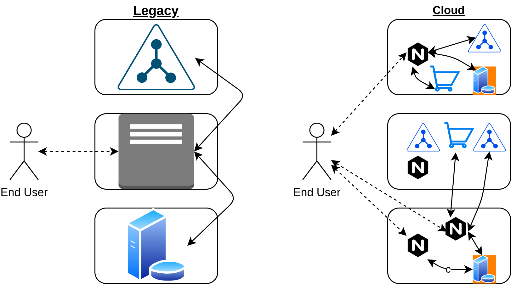

#  02. KUBERNETES ARCHITECTURE

## Introduction

### Introduction to Kubernetes Architecture
### Learning Objectives
- Understand the most common terms related to Kubernetes
- Discuss history of Kubernetes
- Learn about control plane node components
- Learn about worker node components
- Understand the Container Network Interface (CNI) configuration and Network Plugins

## What is Kubernetes?
An open-source system for automating deployment, scaling, and management of containerized
applications. 

Kubernetes is the pilot of a ship of containers.

The nickname is said like Kate's.

Kubernetes is integral in CI/CD:
- Continous Integration: A consistent way to build and test software.
- Continous Delivery: An automated way to test and deploy software into various environments.

## Components of Kubernetes
Kubernetes approaches system scalability by deploying a large number of small web servers, or
microservices (replicas).

It's important that the clients expect the server processes to be terminated and eventually to be
replaced, leading to a transient server deployment.

The transcient nature of smaller services also allows for decoupling. Each aspect of a traditional
application is replaced with a dedicated, but transient, microservice or agent. To join the agents,
or their replacements, together, we user services and API calls. A service ties traffic from one
agent to another (for example, a frontend web server to a backend database).

The decoupled, transient, microservice is not the same than a VM, and K8s is not a VM manager. Most 
legacy applications will need to be rewritten to optimally run in a cloud.

### Legacy vs Cloud Architecture

## Challenges
Containers pride a great way to package, ship, and run applications.

However, managing containers at scale and architecting a distributed application based on
microservice's principles is still challenging.

These are some things that you need:
- A CI/CD pipeline (build container images, test them and verify them)
- A Cluster
- A Container launcher
- Rolling updates and rollbacks
- Flexible, scalable, and easy to manage network storage.

> Would users notice if you ran Chaos Monkey, which terminates any container randomly? If so, you
may have more work making containers and applications more decoupled and transient.

## The Borg Heritage
The Cloud Foundry Foundation embraces the
[twelve-factor application principles](https://12factor.net/). These principles provide great
guidance to build web applications that can scale easily, can be deployed in the cloud, and whose
build is automated. Borg and Kubernetes address these principles as well.

## The Twelve Factors
### I. Codebase
One codebase tracked in revision control, many deploys

### II. Dependencies
Explicitly declare and isolate dependencies

### III. Config
Store config in the environment

### IV. Backing services
Treat backing services as attached resources

### V. Build, release, run
Strictly separate build and run stages

### VI. Processes
Execute the app as one or more stateless processes

### VII. Port binding
Export services via port binding

### VIII. Concurrency
Scale out via the process model

### IX. Disposability
Maximize robustness with fast startup and graceful shutdown

### X. Dev/prod parity
Keep development, staging, and production as similar as possible

### XI. Logs
Treat logs as event streams

### XII. Admin processes
Run admin/management tasks as one-off processes
